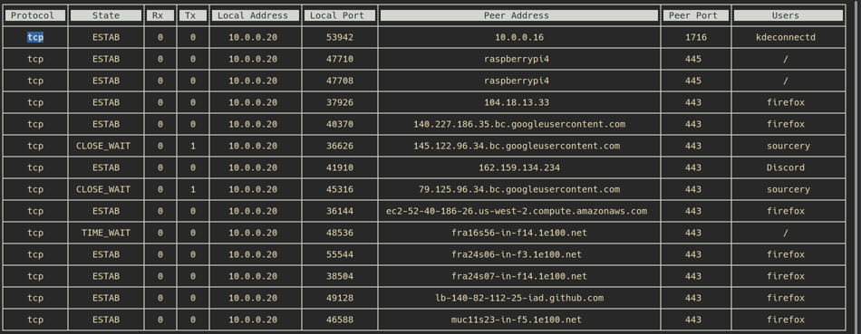

<div align="center">
    <h1>neoss</h1>
    <i>Socket statistics, with an UI.</i>
</div>
<p align="center">
<a href="https://img.shields.io/github/v/release/pablolec/neoss" target="_blank">
    
</a>
<a href="https://github.com/PabloLec/neoss/blob/main/LICENSE" target="_blank">
    
</a>
</p>


---

## Introduction

`neoss` aims to replace usual `ss` command for basic usage. It provides a list of in-use TCP and UDP sockets with their respective statistics.
Its main advantage over `ss` raw output is a clear and simple Terminal User Interface which allows you to sort, refresh and navigate through results.

In addition to regular statistics you can select any data and get an explanation including:

- Protocol definition
- Connection state and queues meaning
- Port standard attribution
- Domain Name resolution
- Whois for domain names and IPs
- Detailed users informations (name, owner, PID and command line)

## Demo

<p align="center">
    
</p>

## Installation

```npm install -g neoss```

## Usage

To launch, simply type: ```neoss```

#### Keys
<kbd>Esc</kbd> or <kbd>q</kbd> or <kbd>Ctrl</kbd>+<kbd>c</kbd> - Exit

<kbd>r</kbd> - Refresh statistics

<kbd>s</kbd> - Sort data based on currently selected column

<kbd>Enter</kbd> - Open/Close detailed informations for currently selected cell
